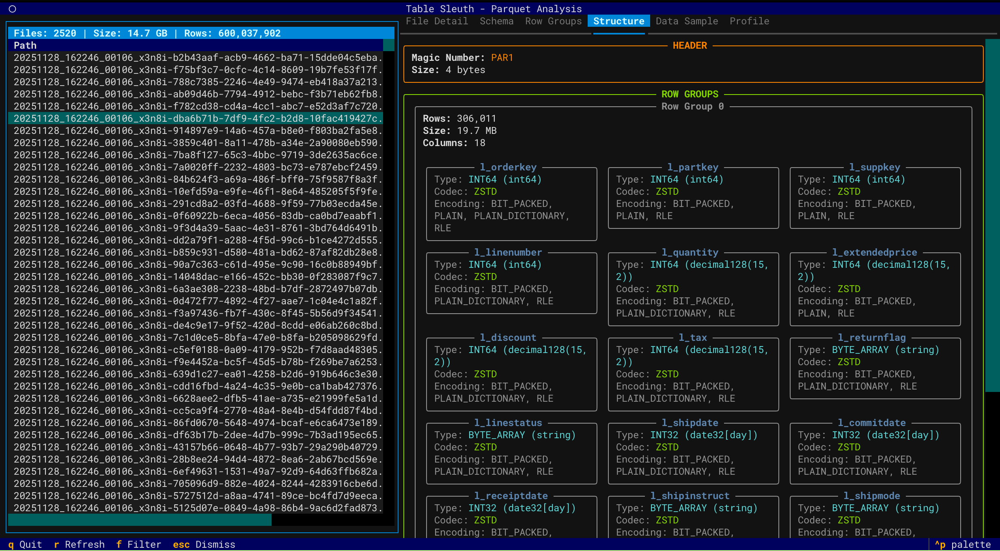
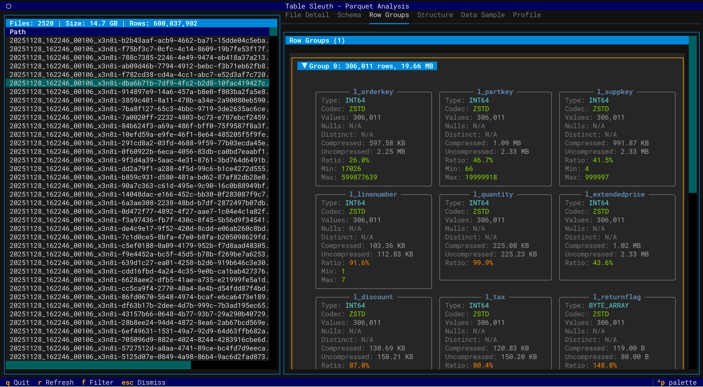
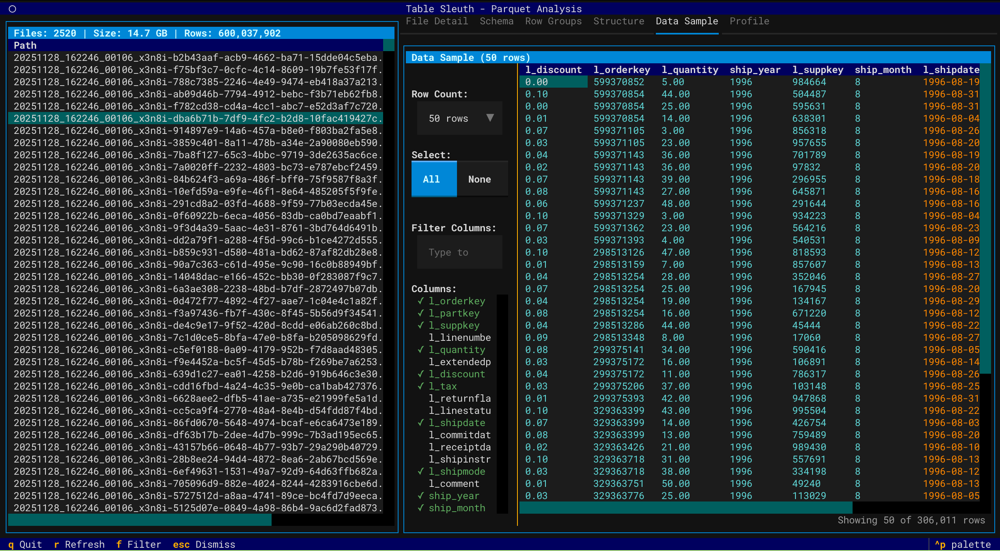
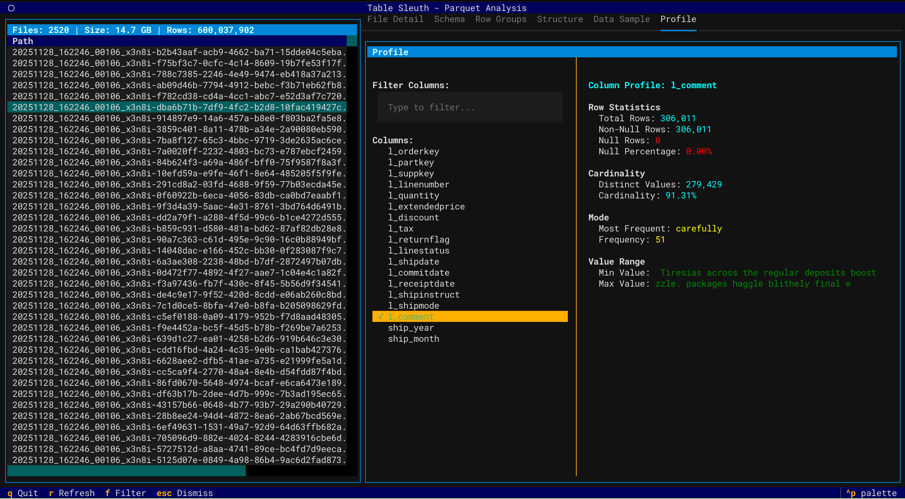
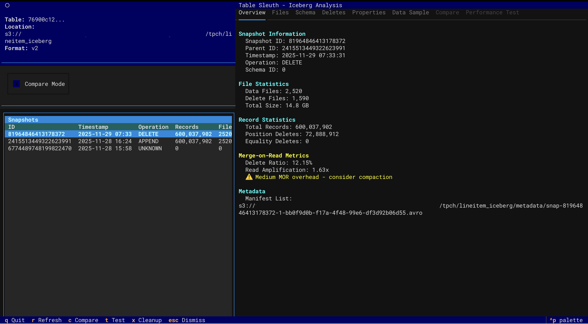
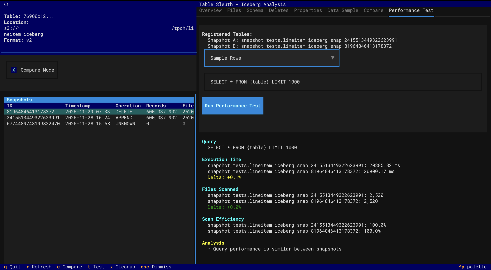
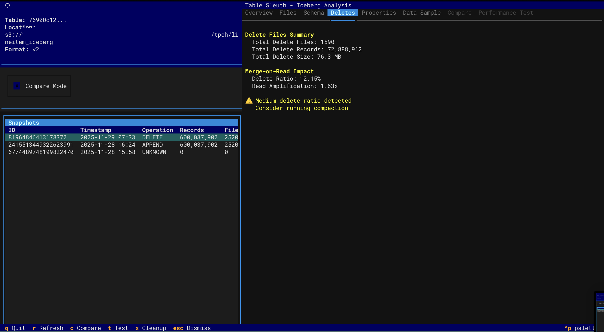
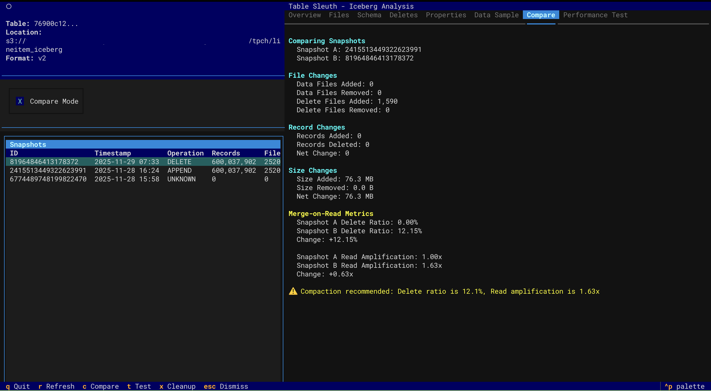

# TableSleuth

[](https://badge.fury.io/py/tablesleuth)
[](https://pypi.org/project/tablesleuth/)
[](https://opensource.org/licenses/Apache-2.0)
[](https://github.com/jamesbconner/table-sleuth/actions)

A powerful terminal-based tool for deep inspection of Parquet files and Apache Iceberg tables. Analyze file structure, metadata, row groups, column statistics, and table evolution with an intuitive TUI interface.

## Key Features

### Parquet Analysis
- **Deep File Inspection** - Comprehensive metadata extraction using PyArrow
- **Row Group Analysis** - Examine distribution, compression, and statistics
- **Column Profiling** - Profile data using GizmoSQL (DuckDB over Arrow Flight SQL)
- **Data Sampling** - Preview and filter data with column selection
- **Directory Scanning** - Recursively discover and inspect Parquet files

### Iceberg Table Analysis
- **Snapshot Navigation** - Browse table history and metadata evolution
- **Performance Testing** - Compare query performance across snapshots
- **Delete File Inspection** - Analyze MOR (Merge-on-Read) delete files
- **Schema Evolution** - Track schema changes over time
- **Catalog Support** - Local SQLite, AWS Glue, and AWS S3 Tables

### Interface
- **Interactive TUI** - Keyboard-driven navigation with rich visualizations
- **Multi-Source Support** - Local files, S3, and Iceberg catalogs
- **Performance Optimized** - Async operations, caching, and lazy loading

## Screenshots

### Parquet File Inspection

<table>
<tr>
<td width="50%">

**File Structure & Schema**


</td>
<td width="50%">

**Row Group Analysis**


</td>
</tr>
<tr>
<td width="50%">

**Data Sample View**


</td>
<td width="50%">

**Column Profiling**


</td>
</tr>
</table>

### Iceberg Table Analysis

<table>
<tr>
<td width="50%">

**Snapshot Overview**


</td>
<td width="50%">

**Performance Testing**


</td>
</tr>
<tr>
<td width="50%">

**Delete Files (MOR)**


</td>
<td width="50%">

**Snapshot Comparison**


</td>
</tr>
</table>

## Quick Start

```bash
# Install with uv (recommended)
uv sync

# Inspect a Parquet file
tablesleuth inspect data/file.parquet

# Inspect a directory (recursive)
tablesleuth inspect data/warehouse/

# Inspect an Iceberg table
tablesleuth inspect db.table --catalog local

# Inspect AWS S3 Tables (using ARN)
tablesleuth inspect "arn:aws:s3tables:us-east-2:123456789012:bucket/my-bucket/table/db.table"
```

**📚 Documentation:**
- **[Quick Start Guide](QUICKSTART.md)** - Get started with examples
- **[Setup Guide](TABLESLEUTH_SETUP.md)** - Complete installation and configuration
- **[User Guide](docs/USER_GUIDE.md)** - Comprehensive usage documentation

## Installation

**Requirements:** Python 3.13+ and [uv](https://docs.astral.sh/uv/)

```bash
# Install from PyPI
pip install tablesleuth

# Or install from source
git clone https://github.com/jamesbconner/TableSleuth
cd TableSleuth
uv sync

# Verify installation
tablesleuth --version
```

See [TABLESLEUTH_SETUP.md](TABLESLEUTH_SETUP.md) for detailed setup including AWS, GizmoSQL, and catalog configuration.

## Configuration

### Basic Configuration

Create `table_sleuth.toml`:

```toml
[catalog]
default = "local"

[gizmosql]
uri = "grpc+tls://localhost:31337"
username = "gizmosql_username"
password = "gizmosql_password"
tls_skip_verify = false
```

### Iceberg Catalogs

Configure PyIceberg in `~/.pyiceberg.yaml`:

```yaml
catalog:
  local:
    type: sql
    uri: sqlite:////path/to/catalog.db
    warehouse: file:///path/to/warehouse
```

**For detailed configuration:**
- **[Setup Guide](TABLESLEUTH_SETUP.md)** - All catalog types and AWS configuration
- **[GizmoSQL Deployment](docs/GIZMOSQL_DEPLOYMENT_GUIDE.md)** - Profiling backend setup

## Usage

### CLI Commands

```bash
# Inspect Parquet files
tablesleuth inspect file.parquet
tablesleuth inspect directory/
tablesleuth inspect s3://bucket/path/file.parquet

# Inspect Iceberg tables
tablesleuth inspect db.table --catalog local
tablesleuth inspect "arn:aws:s3tables:region:account:bucket/name/table/db.table"

# Launch Iceberg viewer
tablesleuth iceberg-viewer --catalog local
```

### TUI Navigation

| Key | Action |
|-----|--------|
| `q` | Quit |
| `r` | Refresh |
| `f` | Filter columns |
| `Tab` | Switch tabs |
| `↑/↓` | Navigate |
| `Enter` | Select |

See [User Guide](docs/USER_GUIDE.md) for complete keyboard shortcuts and features.

## Optional: GizmoSQL Profiling

Enable column profiling and performance testing with GizmoSQL (DuckDB over Arrow Flight SQL).

**Quick Setup:**
```bash
# Install GizmoSQL (macOS ARM64 example)
curl -L https://github.com/gizmodata/gizmosql/releases/download/v1.12.10/gizmosql_cli_macos_arm64.zip \
  | sudo unzip -o -d /usr/local/bin -

# Start server
gizmosql_server -P password -Q -T ~/.certs/cert0.pem ~/.certs/cert0.key
```

See [GizmoSQL Deployment Guide](docs/GIZMOSQL_DEPLOYMENT_GUIDE.md) for complete setup and EC2 deployment.

## Architecture

TableSleuth uses a layered architecture:

- **TUI Layer** - Textual-based terminal interface with rich visualizations
- **Service Layer** - Business logic for file inspection, profiling, and discovery
- **Integration Layer** - PyArrow for Parquet, PyIceberg for tables, GizmoSQL for profiling

See [Architecture Guide](docs/ARCHITECTURE.md) for detailed technical documentation.

## Development

```bash
# Install with dev dependencies
uv sync --all-extras

# Run tests
pytest

# Run quality checks
uv run pre-commit run --all-files

# Type checking
mypy src/
```

See [Development Setup](DEVELOPMENT_SETUP.md) for complete development environment setup.

## Documentation

### Getting Started
- **[Quick Start](QUICKSTART.md)** - Examples and common workflows
- **[Setup Guide](TABLESLEUTH_SETUP.md)** - Installation and configuration
- **[User Guide](docs/USER_GUIDE.md)** - Complete feature documentation

### Advanced Topics
- **[Performance Profiling](docs/PERFORMANCE_PROFILING.md)** - Query performance analysis
- **[GizmoSQL Deployment](docs/GIZMOSQL_DEPLOYMENT_GUIDE.md)** - Profiling backend setup
- **[EC2 Deployment](docs/EC2_DEPLOYMENT_GUIDE.md)** - Automated AWS deployment

### Development
- **[Development Setup](DEVELOPMENT_SETUP.md)** - Dev environment and workflows
- **[Architecture](docs/ARCHITECTURE.md)** - System design and technical details
- **[Developer Guide](docs/DEVELOPER_GUIDE.md)** - API reference and contributing

## What's New

### v0.4.0 (Current)
- 🎉 **Now available on PyPI!** Install with `pip install tablesleuth`
- 🔄 Package renamed to `tablesleuth` for consistency
- 🤖 Automated CI/CD with GitHub Actions
- 📦 Enhanced PyPI metadata and publishing workflow
- ✅ All existing features from v0.3.0

### v0.3.0
- ✅ Parquet file inspection (local and S3)
- ✅ Iceberg snapshot navigation and analysis
- ✅ Delete file inspection and MOR forensics
- ✅ Snapshot comparison and performance testing
- ✅ Column profiling with GizmoSQL
- ✅ AWS Glue and S3 Tables catalog support
- ✅ Interactive TUI with rich visualizations

### Roadmap
- Delta Lake and Hudi support
- Schema evolution visualization
- Export capabilities (JSON, CSV reports)
- REST catalog support
- Automated optimization recommendations

## Contributing

Contributions welcome! See [Developer Guide](docs/DEVELOPER_GUIDE.md) and [Development Setup](DEVELOPMENT_SETUP.md).

## License

MIT License - See [LICENSE](LICENSE) for details.

## Support

- **Issues & Features:** [GitHub Issues](https://github.com/jamesbconner/TableSleuth/issues)
- **Documentation:** See [docs/](docs/) directory
- **Changelog:** [CHANGELOG.md](CHANGELOG.md)
