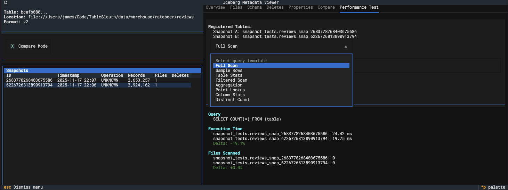
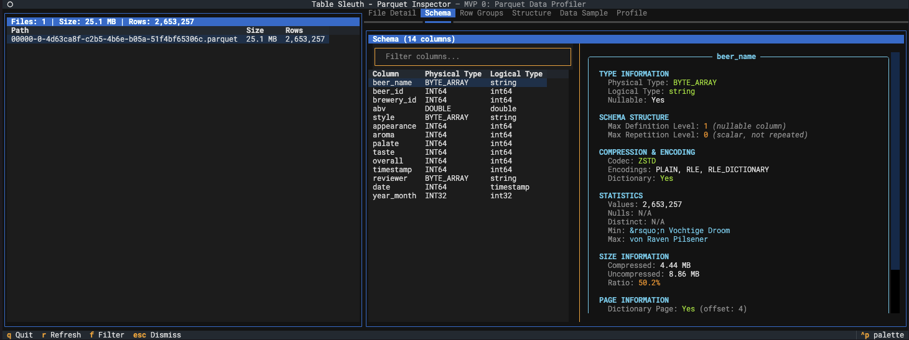
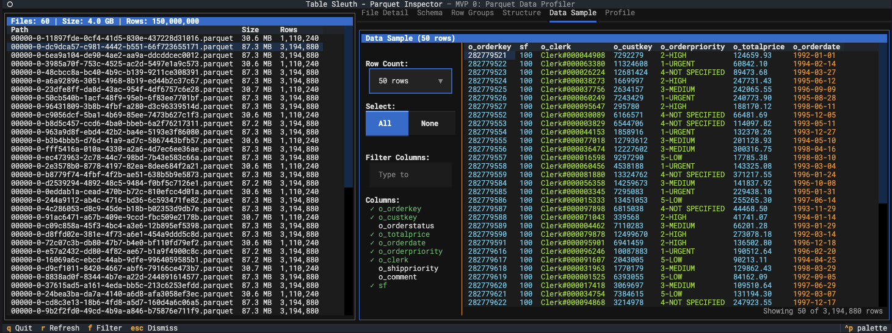
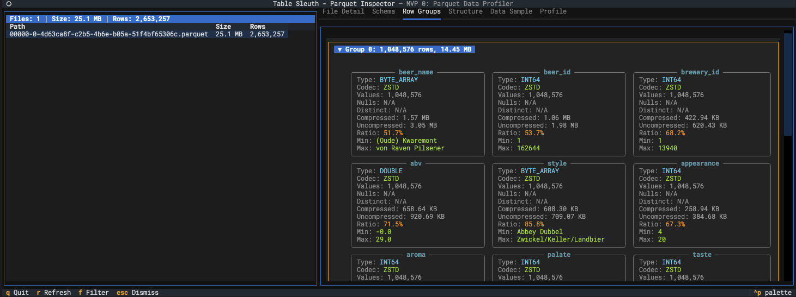

# Table Sleuth

A powerful Parquet file forensics tool with a terminal user interface (TUI) for inspecting file metadata, analyzing data structure, and profiling column statistics.

## Features

- **File Inspection**: Extract and display comprehensive Parquet file metadata using PyArrow
- **Directory Scanning**: Recursively discover and inspect all Parquet files in a directory
- **Iceberg Support**: Discover data files from Iceberg tables via local catalog
- **Interactive TUI**: Navigate files, schemas, row groups, and column statistics with keyboard shortcuts
- **Column Profiling**: Profile column data using GizmoSQL (DuckDB over Arrow Flight SQL)
- **Performance Optimized**: Async operations, caching, and lazy loading for responsive UI

## Screenshots

### Iceberg Table Overview

*Navigate Iceberg table snapshots, view metadata, and explore table structure*

### Iceberg Performance Testing

*Compare snapshot performance and analyze table evolution*

### Parquet File Schema

*Inspect column schemas with detailed type information and statistics*

### Data Sample View

*Preview data with column selection and filtering capabilities*

### Row Group Analysis

*Analyze row group distribution and compression statistics*

## Quick Start

```bash
# Install dependencies
uv sync

# Inspect a single file
table-sleuth inspect data/file.parquet

# Inspect a directory
table-sleuth inspect data/warehouse/

# Inspect an Iceberg table
table-sleuth inspect ratebeer.reviews --catalog local
```

See [QUICKSTART.md](QUICKSTART.md) for detailed examples and [docs/USER_GUIDE.md](docs/USER_GUIDE.md) for comprehensive documentation.

## Installation

### Prerequisites

- Python 3.12 or higher
- `uv` for dependency management

### Install from Source

```bash
# Clone the repository
git clone https://github.com/jamesbconner/TableSleuth>
cd table-sleuth

# Install with uv (recommended)
uv sync --all-extras

# Activate virtual environment
source .venv/bin/activate  # macOS/Linux
.venv\Scripts\activate     # Windows
```

### Verify Installation

```bash
table-sleuth --version
```

## Configuration

Create `table_sleuth.toml` in your project directory or `~/.config/table_sleuth.toml`:

```toml
[catalog]
default = "local"

[gizmosql]
uri = "grpc://localhost:10501"
username = "gizmosql_username"
password = "gizmosql_password"
tls_skip_verify = false
```

For Iceberg support, configure PyIceberg in `~/.pyiceberg.yaml`:

```yaml
catalog:
  local:
    type: sql  # Use SQL catalog for local file-based catalogs
    uri: sqlite:////absolute/path/to/warehouse/catalog.db
    warehouse: file:///absolute/path/to/warehouse
```

## Usage

### CLI Commands

```bash
# Show help
table-sleuth --help

# Inspect a file
table-sleuth inspect data/file.parquet

# Inspect with verbose logging
table-sleuth inspect data/file.parquet --verbose

# Inspect Iceberg table
table-sleuth inspect db.table --catalog local
```

### TUI Navigation

| Key | Action |
|-----|--------|
| `q` | Quit application |
| `r` | Refresh and clear caches |
| `f` | Filter columns by name/type |
| `Tab` | Navigate between tabs |
| `↑/↓` | Navigate lists |
| `Enter` | Select file or item |
| `Click` | Click column in Profile view to profile |

### Tabs

1. **File Detail**: File metadata (size, rows, compression)
2. **Schema**: Column names, types, and filtering
3. **Row Groups**: Row group breakdown and statistics
4. **Column Stats**: Column-level statistics from metadata
5. **Profile**: Profiling results from GizmoSQL

## GizmoSQL Setup (Optional)

For column profiling and Iceberg performance testing:

### Installation

**macOS (ARM64):**
```bash
curl -L https://github.com/gizmodata/gizmosql/releases/download/v1.12.10/gizmosql_cli_macos_arm64.zip \
  | sudo unzip -o -d /usr/local/bin -
```

**macOS (Intel):**
```bash
curl -L https://github.com/gizmodata/gizmosql/releases/download/v1.12.10/gizmosql_cli_macos_amd64.zip \
  | sudo unzip -o -d /usr/local/bin -
```

**Linux:**
```bash
curl -L https://github.com/gizmodata/gizmosql/releases/download/v1.12.10/gizmosql_cli_linux_amd64.zip \
  | sudo unzip -o -d /usr/local/bin -
```

### Start Server

```bash
GIZMOSQL_PASSWORD="gizmosql_password" gizmosql_server --port 10501 --print-queries
```

### Configure

Update `table_sleuth.toml`:
```toml
[gizmosql]
uri = "grpc://localhost:10501"
username = "gizmosql_username"
password = "gizmosql_password"
tls_skip_verify = false
```

See [docs/gizmosql-deployment.md](docs/gizmosql-deployment.md) for detailed setup instructions.

## Architecture

```
┌─────────────────────────────────────────────────────────────┐
│                      Textual TUI Layer                      │
│  File List | File Detail | Schema | Row Groups | Profile    │
└─────────────────────────────────────────────────────────────┘
                            │
┌─────────────────────────────────────────────────────────────┐
│                     Service Layer                           │
│  Parquet Inspector | Profiling Backend | File Discovery     │
└─────────────────────────────────────────────────────────────┘
                            │
┌─────────────────────────────────────────────────────────────┐
│                   External Systems                          │
│  PyArrow | GizmoSQL (DuckDB/ADBC) | PyIceberg               │
└─────────────────────────────────────────────────────────────┘
```

## Project Structure

```
table-sleuth/
├── src/table_sleuth/
│   ├── cli.py                 # CLI entry point
│   ├── config.py              # Configuration management
│   ├── models/                # Data models
│   ├── services/              # Business logic
│   │   ├── parquet_service.py
│   │   ├── file_discovery.py
│   │   └── profiling/
│   └── tui/                   # Terminal UI
│       ├── app.py
│       ├── views/
│       └── widgets/
├── tests/                     # Test suite
├── docs/                      # Documentation
└── .kiro/specs/              # Feature specifications
```

## Development

### Running Tests

```bash
# Run all tests
pytest

# Run with coverage
pytest --cov=src/table_sleuth --cov-report=html

# Run specific test file
pytest tests/test_parquet_inspector.py
```

### Code Quality

```bash
# Format code
ruff format .

# Lint code
ruff check .

# Type checking
mypy src/table_sleuth
```

## Documentation

- [User Guide](docs/USER_GUIDE.md) - Comprehensive usage guide
- [Quick Start](QUICKSTART.md) - Get started quickly with examples
- [Performance Profiling](docs/PERFORMANCE_PROFILING.md) - Performance analysis guide
- [Product Specification](docs/product_specification.md) - Product requirements
- [Technical Specification](docs/technical_specification.md) - Technical details

## Roadmap

### MVP 0 (Current) ✅
- Parquet file inspection
- Directory scanning
- Basic Iceberg file discovery
- Column profiling with GizmoSQL
- Interactive TUI

### MVP 1 (Planned)
- Full Iceberg snapshot navigation
- Delete file inspection
- Merge-on-read analysis
- Schema evolution tracking
- Performance profiling
- Export capabilities

## Contributing

Contributions are welcome! Please see the developer documentation in `.kiro/specs/` for architecture details and contribution guidelines.

## License

[Add license information]

## Support

For issues, questions, or feature requests, please open an issue on the repository.
